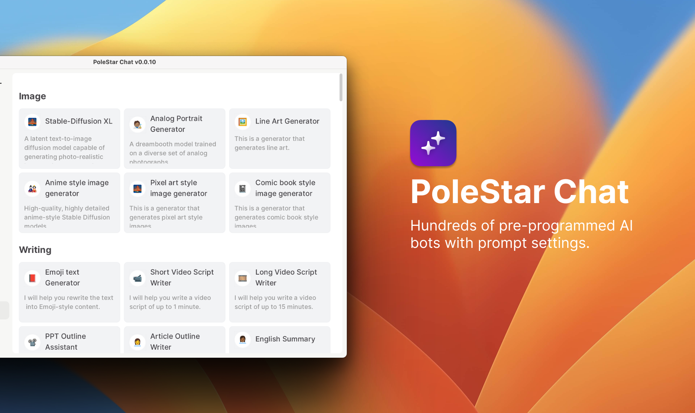

# Scenario 5: Rewriting Content

<head>
  <script defer="defer" src="https://embed.trydyno.com/embedder.js"></script>
  <link href="https://embed.trydyno.com/embedder.css" rel="stylesheet" />
</head>

## Scenario

Beyond generating content from scratch, you can also provide existing content to the AI and have it modify or enhance it. Use cases include:

1. Translation: Convert Chinese to English, or English to Chinese. Notably, ChatGPT can also translate code, like from Python to Haskell.
2. Editing: Fix grammar, typos, etc.
3. Rewriting: Restyle text into a different tone or for different audiences.

Let's focus on rewriting for this chapter. Here's an example rewriting prompt (content from Wikipedia):

```other
Please rewrite the following sentences to make them easier to understand.
OpenAI is an American artificial intelligence (AI) research laboratory consisting of the non-profit OpenAI Incorporated (OpenAI Inc.) and its for-profit subsidiary corporation OpenAI Limited Partnership (OpenAI LP). OpenAI conducts AI research with the declared intention of promoting and developing a friendly AI. OpenAI systems run on the fifth most powerful supercomputer in the world.[5][6][7] The organization was founded in San Francisco in 2015 by Sam Altman, Reid Hoffman, Jessica Livingston, Elon Musk, Ilya Sutskever, Peter Thiel and others,[8][1][9] who collectively pledged US$1 billion. Musk resigned from the board in 2018 but remained a donor. Microsoft provided OpenAI LP with a $1 billion investment in 2019 and a second multi-year investment in January 2023, reported to be $10 billion.[10]
```

The output is as follows:

```other
OpenAI is a research organization that focuses on artificial intelligence (AI). It has two parts: a non-profit called OpenAI Incorporated and a for-profit subsidiary called OpenAI Limited Partnership. The organization's goal is to create AI that is friendly and beneficial to humans. OpenAI uses one of the most powerful supercomputers in the world for its research. The organization was founded in San Francisco in 2015 by a group of people who pledged a total of $1 billion, including Sam Altman, Reid Hoffman, Jessica Livingston, Elon Musk, Ilya Sutskever, and Peter Thiel. Musk resigned from the board in 2018 but still supports the organization financially. In 2019, Microsoft invested $1 billion in OpenAI LP, and in January 2023, they made a second investment reported to be $10 billion.
```

## Tip 4: Add Roles or Characters

The rewrite example above added a role to "make it easier to understand", a common optimization. Roles like "for a business audience" work too.

An even better technique is specifying a role or character in the prompt to better match the desired output.

For the same rewrite example, I pretended to be an elementary school teacher simplifying text for 7-8 year olds:

```other
You are a primary school teacher who can explain complex content to a level that a 7 or 8 year old child can understand. Please rewrite the following sentences to make them easier to understand:
```

The output uses simpler words and grammar:

```other
OpenAI is a place where people work on making computers really smart. It's like a lab where they do research to make computers do amazing things! They want the computers to be really friendly and helpful to people. They use one of the most powerful computers in the world to do this research. A bunch of really rich and smart people gave money to start this lab. One of them is Elon Musk, but he left in 2018. Another really big company, Microsoft, gave them a lot of money too.
```

You can also mimic a specific person, like having the AI rewrite as famous author David Foster Wallace:

```other
Imagine you are the famous writer David Foster Wallace, please rewrite this sentences.
```

It returns:

```other
As David Foster Wallace, I might rewrite these sentences to sound more like this:

OpenAI is a lab that studies something called artificial intelligence, which is like when computers can do things that normally only humans can do. They have a big computer that's one of the most powerful in the world, and they're trying to make sure the AI they create is friendly and helpful. The lab was started in 2015 in a city called San Francisco, and a bunch of important people gave them a lot of money to do their research. One of those people was Elon Musk, who stopped working there but still gives them money, and Microsoft also gave them a lot of money recently.
```

For more on using this technique and AI to improve writing, I recommend Nat Eliason's [Using ChatGPT as a Writing Coach](https://blog.nateliason.com/p/chatgpt-writing-coach)

## One More Thing

Adding roles can greatly improve the accuracy of AI responses, but writing good roles is not simple. Also in daily use, you may need prompts with multiple different roles, like a teacher for learning or a translation assistant. Switching prompts frequently in ChatGPT can be inconvenient.

To address this, our [PoleStar Chat](https://github.com/thinkingjimmy/PoleStarChat) offers 100+ premade AI bots with role prompts covering education, writing, entertainment and more. You can invoke prompts quickly like using any IM app, with @mentions. For example, @ the Tarot Master bot for a daily reading, without learning prompt setup:


