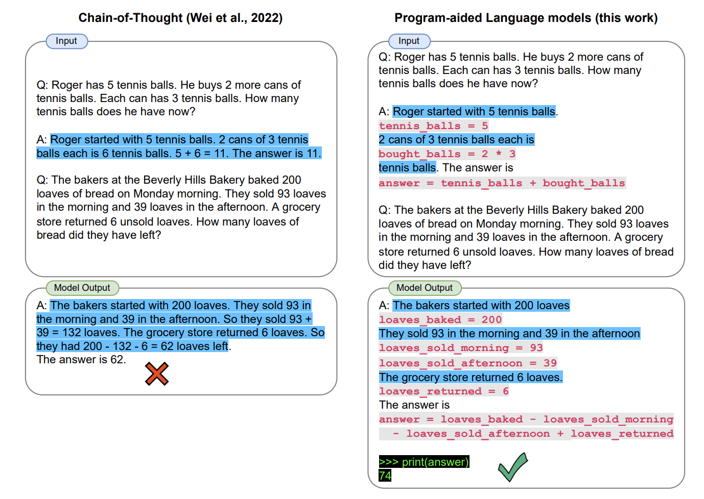

# PAL Models

<head>
  <script defer="defer" src="https://embed.trydyno.com/embedder.js"></script>
  <link href="https://embed.trydyno.com/embedder.css" rel="stylesheet" />
</head>

PAL Models stand for Program-Aided Language Models. Note this is quite advanced, even hacky in my opinion. Through testing, I've found current ChatGPT capabilities may not need this technique anymore.

But I've seen it in many PE tutorials, so will briefly introduce it. The technique is from 2022 research by [Luyu Gao et al.](https://arxiv.org/pdf/2211.10435.pdf) on augmenting reasoning in LLMs with modular programs. Even with chain of thought, their models still struggled with this prompt:

```other
Q: Roger has 5 tennis balls. He buys 2 more cans of
tennis balls. Each can has 3 tennis balls. How many
tennis balls does he have now?
A: Roger started with 5 tennis balls. 2 cans of 3 tennis
balls each is 6 tennis balls. 5 + 6 = 11. The answer is 11.

Q: The bakers at the Beverly Hills Bakery baked 200
loaves of bread on Monday morning. They sold 93 loaves
in the morning and 39 loaves in the afternoon. A grocery
store returned 6 unsold loaves. How many loaves of
bread did they have left?
```

The paper mentions that their model's output, at that time, was as follows:

```other
A: The bakers started with 200 loaves. They sold 93 in
the morning and 39 in the afternoon. So they sold 93 +
39 = 132 loaves. The grocery store returned 6 loaves. So
they had 200 - 132 - 6 = 62 loaves left.
The answer is 62.
```

If you input the same prompt into the latest version of ChatGPT, the answer is already correct:

```other
A: The bakers baked 200 loaves of bread. They sold 93 + 39 = 132 loaves. After the grocery store returned 6 unsold loaves, the bakery had 200 - 132 + 6 = 74 loaves of bread left. The answer is 74.
```

Luyu Gao's solution back then was to introduce code in the prompt and guide the model to use the code for computation and reasoning, resulting in the correct answer:


