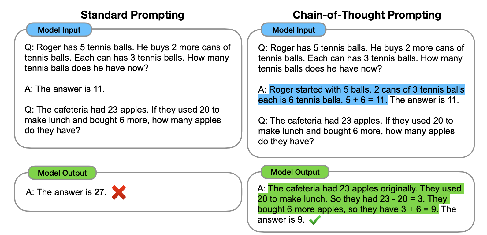

# Tip 8: Few-Shot Chain of Thought

To address this, we can use few-shot chain of thought.

According to Wei et al.'s 2022 [research](https://arxiv.org/pdf/2201.11903.pdf):

> By showing large language models a small number of examples and explaining the reasoning process in the examples, the models will also show reasoning when answering prompts. These reasoning explanations often lead to more accurate results.

Here is an example from their paper, and the usage is simple. Based on Tip 2, we provide the model with both examples and the logical reasoning process. From the example below, you can see that including the explanation yields the correct output.



The example from this chapter's opening would be (also from Wei et al.)::

```other
The odd numbers in this group add up to an even number: 4, 8, 9, 15, 12, 2, 1.
A: Adding all the odd numbers (9, 15, 1) gives 25. The answer is False.

The odd numbers in this group add up to an even number: 17,  10, 19, 4, 8, 12, 24.
A: Adding all the odd numbers (17, 19) gives 36. The answer is True.

The odd numbers in this group add up to an even number: 16,  11, 14, 4, 8, 13, 24.
A: Adding all the odd numbers (11, 13) gives 24. The answer is True.

The odd numbers in this group add up to an even number: 17,  9, 10, 12, 13, 4, 2.
A: Adding all the odd numbers (17, 9, 13) gives 39. The answer is False.

The odd numbers in this group add up to an even number: 15, 32, 5, 13, 82, 7, 1.
A:
```

After covering the technique, let's relate this back to zero-shot chain of thought with some key learnings on chaining. According to research by [Sewon Min](https://arxiv.org/search/cs?searchtype=author&query=Min%2C+S) et al. in [2022](https://arxiv.org/abs/2202.12837), Chain of Thought exhibits the following characteristics:

1. "the label space and the distribution of the input text specified by the demonstrations are both key (regardless of whether the labels are correct for individual inputs)"
2. the format you use also plays a key role in performance, even if you just use random labels, this is much better than no labels at all.

Understanding these characteristics might be a bit challenging, so let me provide an example prompt (🆘 if you have a better explanation, please feel free to share it with me). I will provide ChatGPT with some potentially inaccurate examples:

```other
I loved the new Batman movie!  // Negative
This is bad // Positive
This is good // Negative
What a good show! //
```

Output：

```other
Positive
```

In the example above, each line contains a sentence and an emotional word, separated by "//". However, I have labeled these sentences with incorrect emotions. For example, the first sentence should actually be "Positive". However:

1. Even with incorrect labels, the model still learns what to output - that is, an emotion word assessing each sentence after the // divider. So precise factuality of labels and examples doesn't matter. The labels, text, and format are key, as point #1 notes.
2. The formatting alone helps generate better results even with random labels, as point #2 states.

Lastly, remember chaining only works on models with 100B+ parameters.

For more, see Stanford's lecture notes on:[Natural Language Processing with Deep Learning](http://web.stanford.edu/class/cs224n/slides/cs224n-2023-lecture11-prompting-rlhf.pdf)
