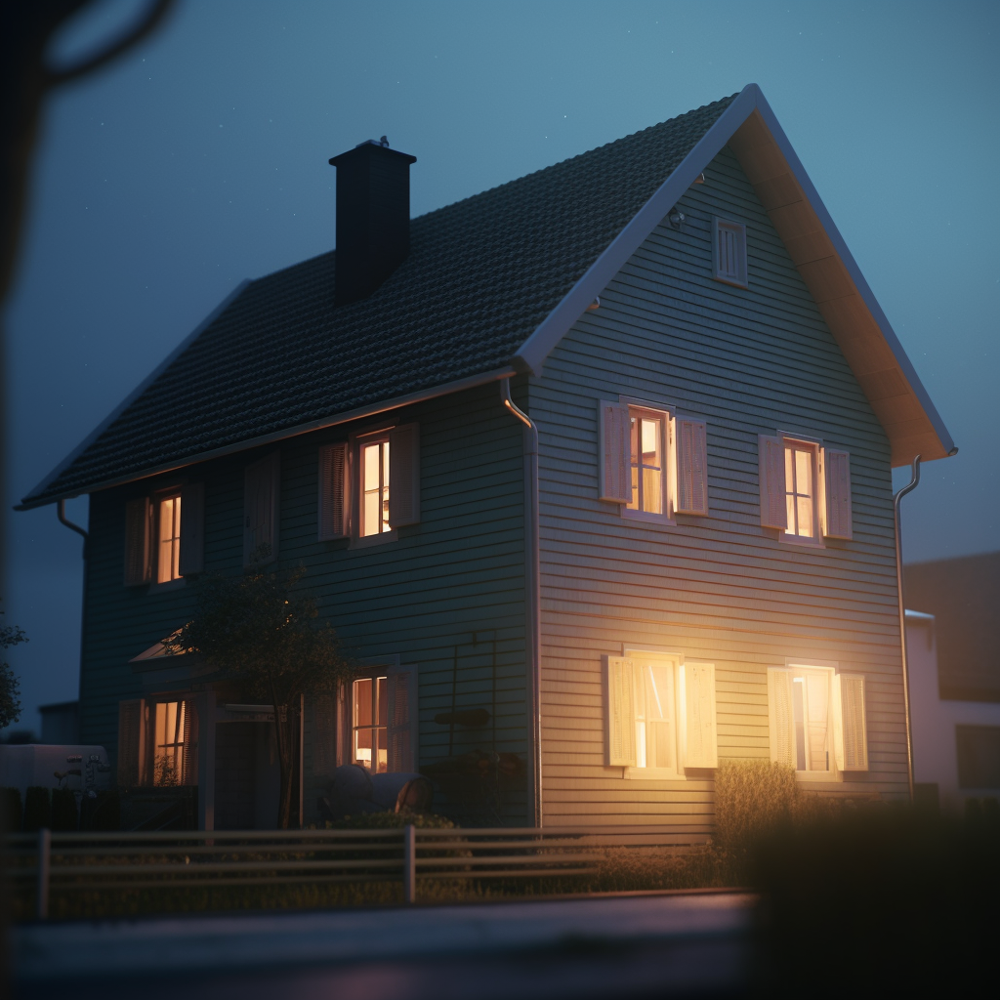
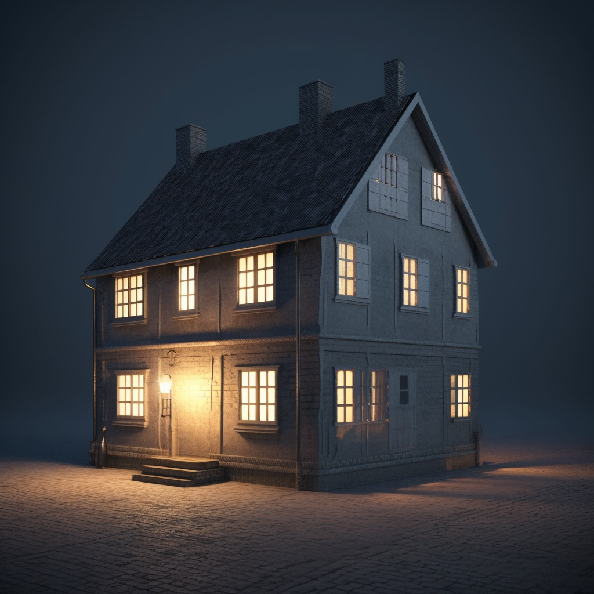
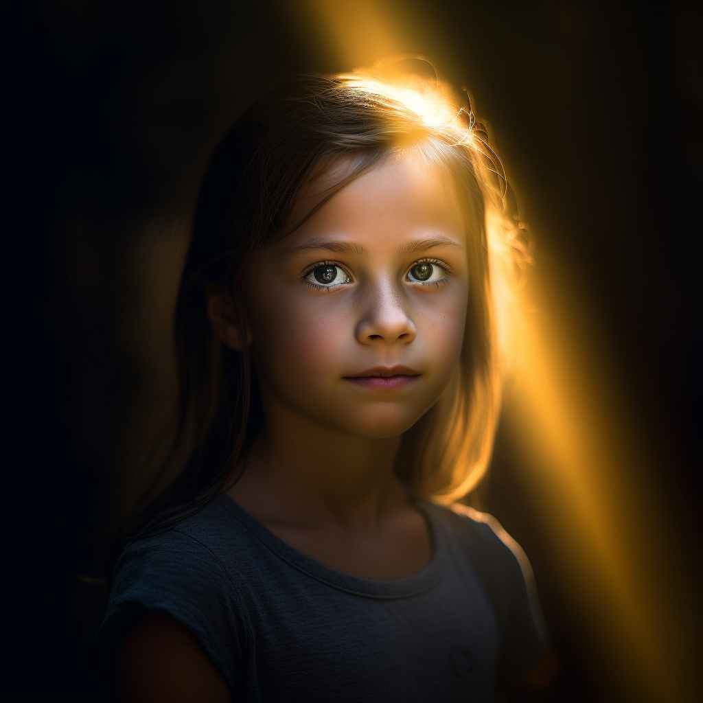
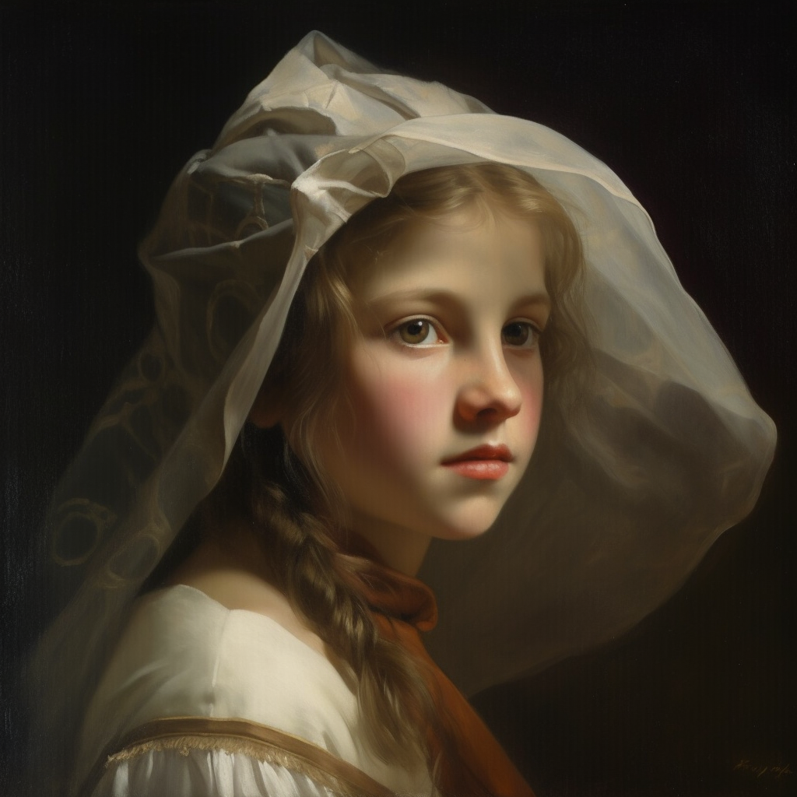
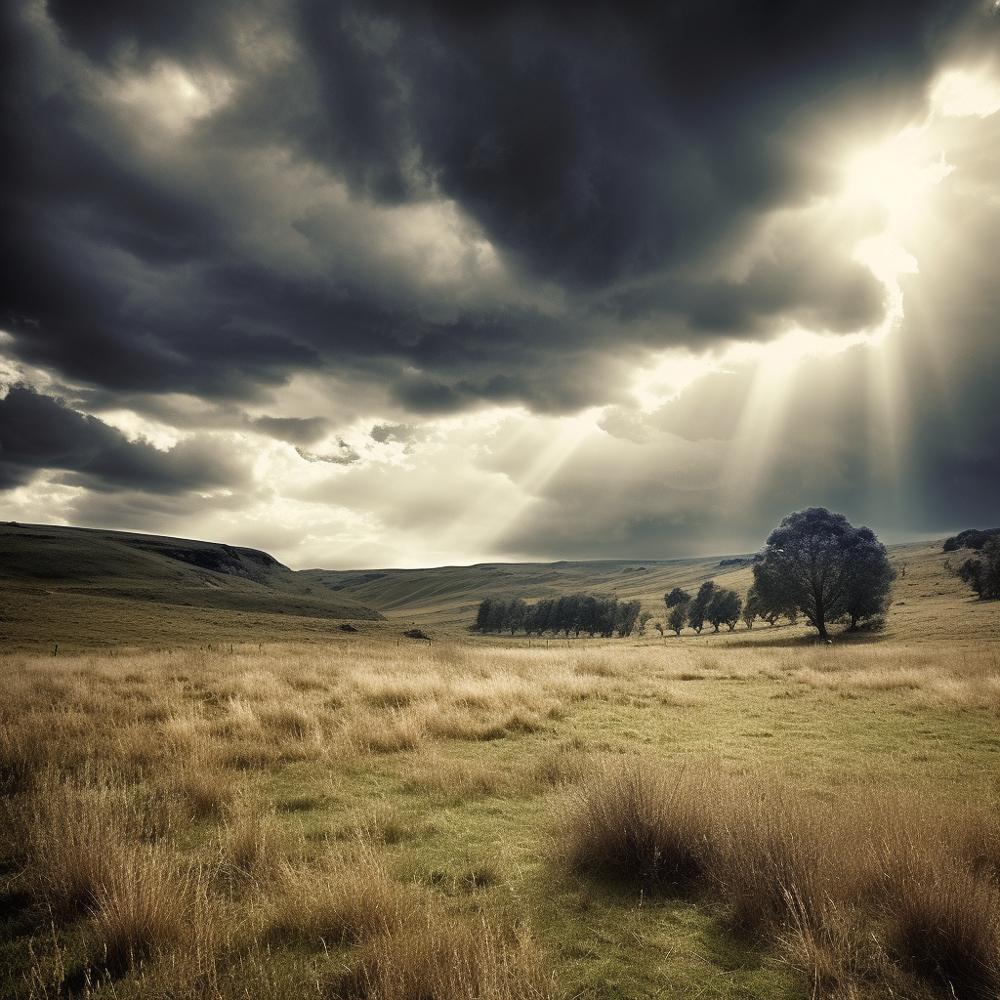

# 💡 Lighting List

> For length I won't cover many styles here, but I'll share more on my [Twitter](https://twitter.com/hellojimmywong) - follow me there for updates.

| 
**Photo**
              | **Name**                 | **Description**                                                                                                                                                                                                                        | **Use Cases**                                                                                                                                                         |
| ----------------------------------------------------- | ------------------------ | -------------------------------------------------------------------------------------------------------------------------------------------------------------------------------------------------------------------------------------- | --------------------------------------------------------------------------------------------------------------------------------------------------------------------- |
|  | Mood Lighting            | Lighting focused on creating a specific ambiance via color, brightness, etc to induce certain feelings like coziness or romance. More about color/brightness control for strong visual impact.                                         | Indoor design, hotels, restaurants, homes to create desired atmospheres and experiences.                                                                              |
|  | Moody Lighting           | More about emotional expression and serving the narrative/plot, combining lighting seamlessly with storyline to convey personality and inner worlds of characters. Uses low brightness and heavy shadowing for textured, layered look. | TV, film, games, theater to increase dramatic effects.                                                                                                                |
|  | Studio Lighting          | Lighting setups designed for photography studios, TV, film. Places light sources and fixtures in a dedicated studio to create various atmospheres and scenes to meet different shooting needs.                                         | Commercial photography, fashion photography, fine art photography, portraiture, advertising, TV/film production to highlight subjects optimally.                      |
|  | Cove Lighting            | Common indoor lighting where fixtures are installed in cavities ("coves") between walls and ceilings to create uniform, comfortable, soft illumination.                                                                                | Provides even room lighting while enhancing aesthetics.                                                                                                               |
|  | Soft Lighting            | Uses diffused, indirect lighting to create soft, warm ambiance. Usually via fixtures like sconces, lamps, reading lights.                                                                                                              | Reduces brightness, eases eye strain, creates comfortable atmosphere.                                                                                                 |
|  | Hard Lighting            | Concentrated, directed light like spotlights or floodlights focused on specific areas. Creates harsh, bright illumination.                                                                                                             | Often used in exhibits like museums and malls to highlight features of displays/products.                                                                             |
|  | Volumetric Lighting      | Adds lighting effects like diffusion, fog, particles, shadows to simulate light interacting with particles/dust in air, creating dynamic, realistic, enhanced depth/volume.                                                            | Film, TV, video games, animation - adds realism, depth, visual excitement and drama.                                                                                  |
|  | Low-Key Lighting         | High contrast via strong side/back light and shadow, with shadows dominating creating tense, mysterious, or somber moods.                                                                                                              | Film, TV, photography for suspense, horror, crime elements.                                                                                                           |
|  | High-Key Lighting        | Bright, even lighting avoiding dark shadows, with high brightness and detail. Conveys cheerful, calm, happy moods.                                                                                                                     | Advertising, emotional films/TV.                                                                                                                                      |
|  | Epic Light               | Adds intense, grand, striking light to grab attention and create visual spectacle/impact.                                                                                                                                              | Film, TV, games, theater for sublime, magnificent atmosphere - emotionally impacts audience.                                                                          |
|  | Rembrandt Lighting       | Lighting style invented by painter Rembrandt featuring a diamond-shaped light-dark divide on the subject's face, with shadows covering one cheek and the other lit by highlights. Creates soft, mysterious lighting.                   | It creates a soft and mysterious effect.                                                                                                                              |
|  | Contre-Jour              | Placing the light source behind the subject so it shines into the camera, creating high-contrast negative space silhouettes. The blurred light source and strong contours create artistic, abstract moods.                             | The overall bokeh of dark photography caused by the position of the light source, high contrast and sharp contour lines can bring a literary and abstract atmosphere. |
|  | Veiling Flare            | Stray light scattering and reflecting through the lens or optics, distorting the image with haze.                                                                                                                                      |                                                                                                                                                                       |
|  | Crepuscular Rays         | Rays of sunlight breaking through clouds/dust. Called "godrays." Appear at sunrise/sunset when sunlight angles perfectly to penetrate cloud cover.                                                                                     | Appear as striking beams of light in clouds, looking beautiful.                                                                                                       |
|  | Rays of Shimmering Light | Light refraction effects when light scatters/refracts passing through mediums of varying density/temperature. Under the right conditions, light appears to shimmer and refract, creating gleaming beams.                               |                                                                                                                                                                       |
|  | Godrays                  | Beams of light created when sunlight penetrates gaps in clouds, tree branches, obstacles. Appear in high brightness and slice sunlight into stripes, looking magical. Alternative name for crepuscular rays.                           |                                                                                                                                                                       |
