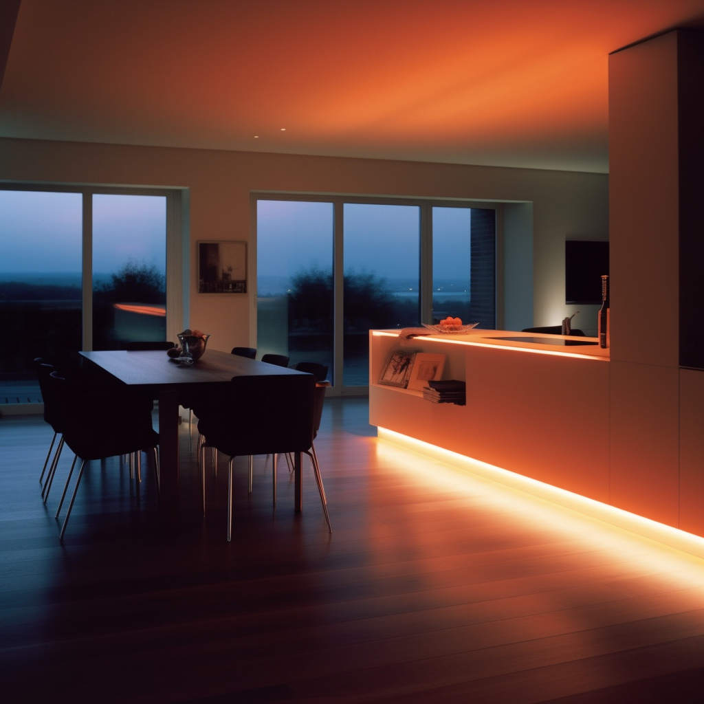
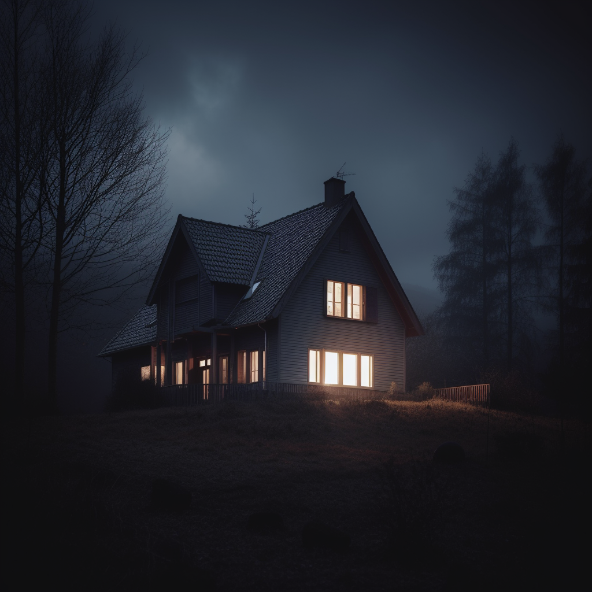
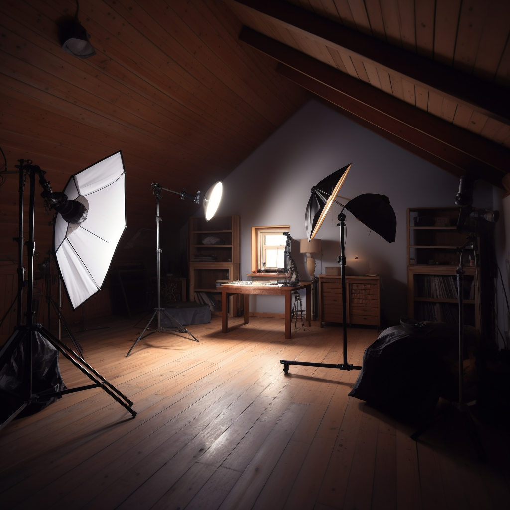
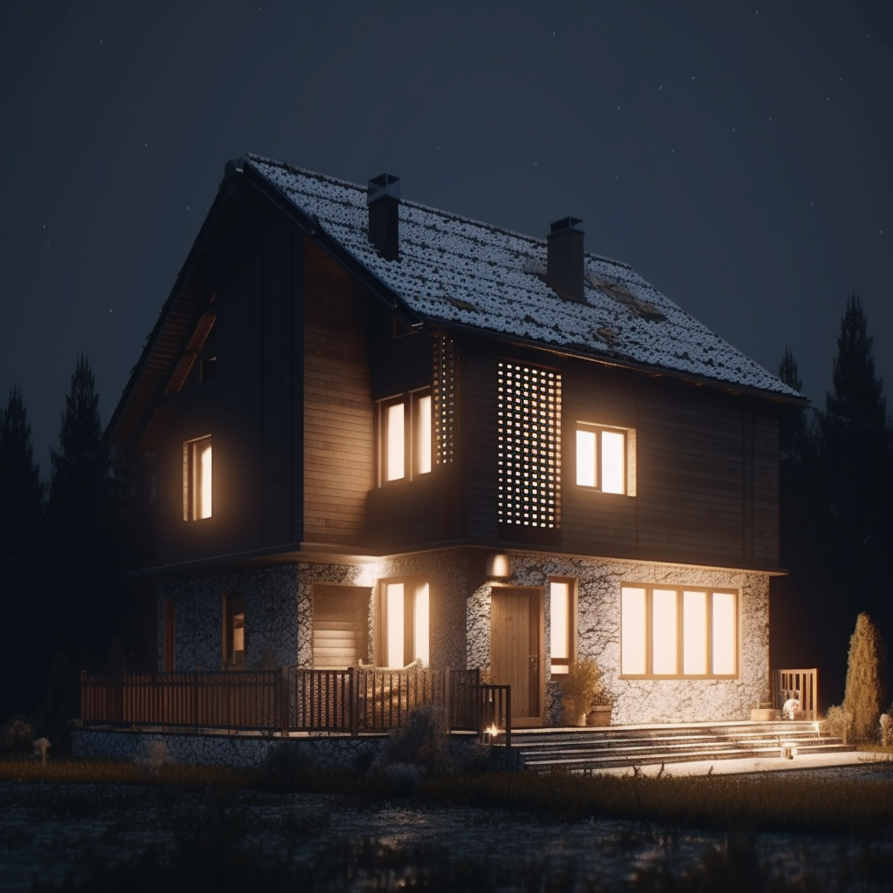
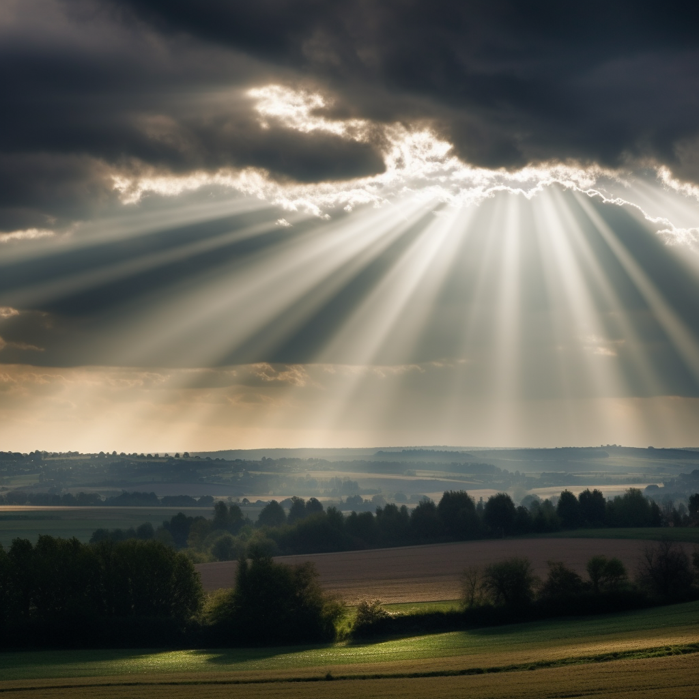
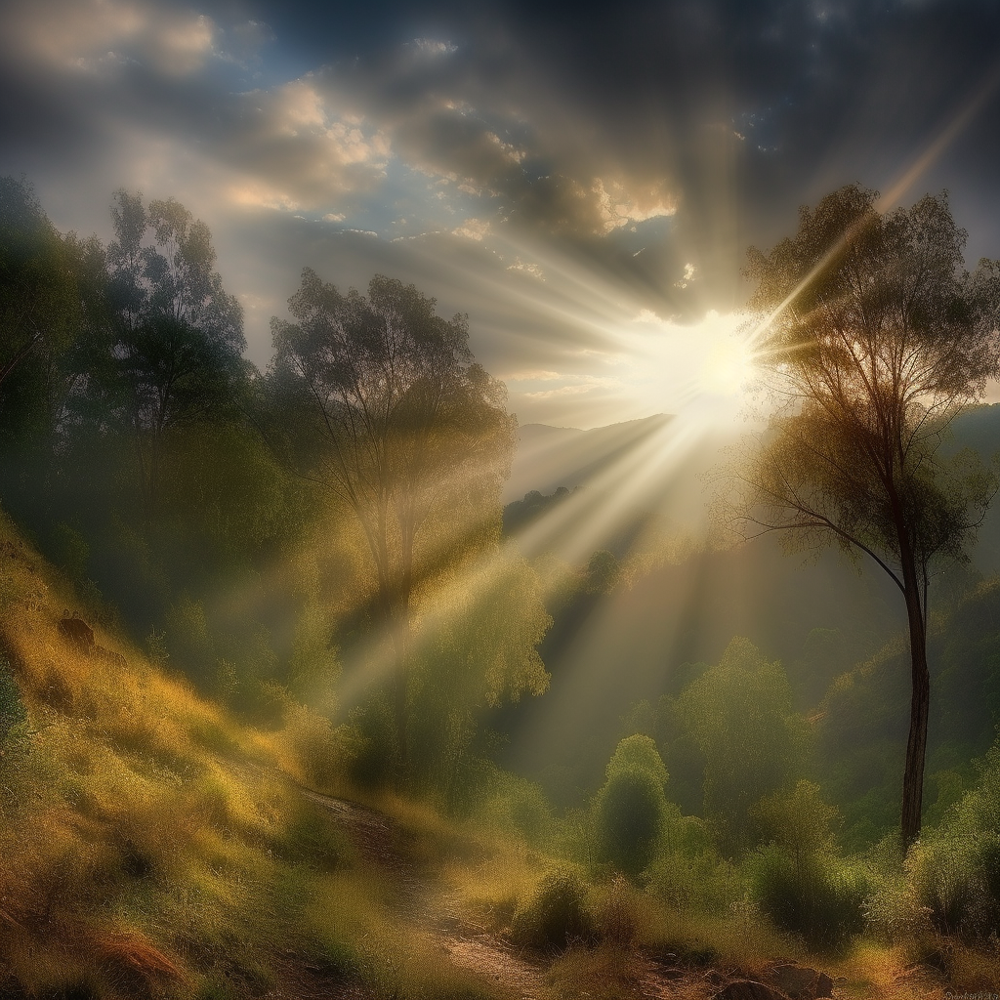

# Scenario 7: Material Object

## Is it better to have ChatGPT generate prompts?

I have used ChatGPT to assist with prompt generation, but not in Role mode. Instead I ask it to:

1. Translate: I know what I want but don't know the English description.
2. Answer questions: I need stylistic words but don't know what to ask, e.g. "What are some famous Renaissance artists?"

Why not use Role mode?

While having ChatGPT generate content in Role mode can save time and effort, personally I feel:

1. It's more cumbersome to use, requiring a lot of prompting even with apps to save contexts. The token limit gets hit quickly needing restarting.
2. Based on how ChatGPT works, it will only generate "average" content. Most people can't even reach "average," so the results seem amazing. But for original, stunning images, rely on your imagination not probability.

But that's just my two cents - if you find it more efficient, go for it! The right tool is what works for you.

## Toys

OK back on track - starting this chapter, we'll gradually enrich our prompt framework with more details. The first real world scene is toys, a very fun one.

Combining this with a 3D printer could be amazing - hopefully some makers can bring that to life!

Let me explain the prompt updates. From this image, I'll change "background" to "environment" - the subject's surroundings including background, lighting, etc:

|                          | **Prompt**                        | **Explanation**                                                                                         |
| ------------------------ | --------------------------------- | ------------------------------------------------------------------------------------------------------- |
| What is the type?        | product photography               | Product photos                                                                                          |
| What is the subject?     | Stormtrooper, plastic, toy        | Using Stormtrooper and Darth Vader again. Since figures are usually plastic toys, I added those words   |
| What is the background?  | white background, studio lighting | Background: White to make the toy pop <br/> Lighting: Add some studio lighting to highlight the product |
| What is the composition? | null                              | Not too important, let AI decide                                                                        |
| What lens?               | null                              | Not too important, let AI decide                                                                        |
| What is the style?       | hand painted,                     | I checked and figure styles seem to only be hand painted                                                |

I also tried a Blue-Eyes White Dragon from Yu-Gi-Oh, but Midjourney doesn't know the reference so generated a literal blue/white dragon:

|                      | **Prompt**                           | **Explanation** |
| -------------------- | ------------------------------------ | --------------- |
| What is the subject? | Blue-Eyes White Dragon, plastic, toy | Same as above   |

Here are the generated images:


Midjourney seems much better with American anime/movies - here's Dragon Mom from Game of Thrones (though the dragon looks weird), and Joan of Arc:


## Tip 11: Add Styles - Countries

Speaking of figures, Japan likely comes to mind first. Here's a technique - add "Japanese style" to get:


Joan of Arc has some Final Fantasy vibes now. The logo also looks more clean/simple, the cat more anime-esque. Other options are Chinese (left 4 images) or even African style:


## Tip 12: Increase Weight

Notice how in the Chinese figures, only the 3rd looks Chinese? That's because the low weight of "Chinese style" resulted in only one output. You'll encounter ignored prompt words too, like mentioning a bird but none in the image.

Why does this happen? Prompt words are weighted by order (see my Midjourney FAQ). In our prompt, Chinese style was last, hence the fewest results. To fix missing elements, weight is likely the issue.

**There are many ways to increase weight, the simplest is re-ordering**. For example, putting Chinese style first (the results become small-eyed style! I generated twice, the second is better):

```other
product photography, Chinese Style,Joan of Arc, full body, hand painted, plastic, detailed, white background, studio lighting
```

Simply re-ordering makes a big difference, so don't blindly follow supposed templates - experiment!


**Second method is slider.**

Add :: after your prompt, then the word to adjust, :: again, and the weight value. For our example without reordering:

```other
product photography,Joan of Arc, full body, hand painted, plastic, detailed, white background, studio lighting, Chinese Style :: Chinese Style :: 0.5
```

The weight seems too high, generating unrelated images (bottom left). Let's add Joan of Arc weight on top of it (bottom right):

```other
product photography,Joan of Arc, full body, hand painted, plastic, detailed, white background, studio lighting, Chinese Style :: Joan of Arc:: 0.25 style of Chinese:: 0.5
```

With tuned parameters, 2 of the 4 images have stronger Chinese style:


Honestly this method isn't great for this case - reordering content or weights has higher ROI. Slider is better for missed prompt words, like the official example:

```other
several sad cats watch a crying woman in a home-office environment with laptop
```

The images focus on you, not the crying woman (left 4 images). Using slider (right 4 images) fixes that:

```other
several sad cats watch a crying woman in a home-office environment with laptop:: several sad cats::0.5 crying woman::0.6 laptop::0.7
```

Note slider values are 0.25, 0.5, 0.6, 0.7. You can also reduce weights with -0.7, -0.6, -0.5, -0.25:


If slider still doesn't work, there's a last resort **cowbell** which frankly goes against Midjourney best practices, but can work - in this prompt the woman doesn't look shy (left 4 images):

```other
A songbird sits on the shoulder of a shy blonde woman dressed in white.
```

You can repeat words:

```other
A songbird sits on the shoulder shoulder shoulder shoulder shoulder shoulder of a shy shy shy shy shy shy shy blonde woman dressed in white.
```


## Food

Another great real world subject is food. Food is all about "color, aroma, taste" - think along those lines for food prompts:

- Color: What color is the food (control via doneness)
- Aroma: Photos lack smell but we can paint the aroma
- Taste: Likewise no taste, so add garnish like pepper, salt, chili?

|                          | **Prompt**                                                      | **Explanation**                                                           |
| ------------------------ | --------------------------------------------------------------- | ------------------------------------------------------------------------- |
| What is the type?        | food photography                                                | Food photo                                                                |
| What is the subject?     | steak, medium rare, steaming, light garnishes, sitting on plate | Steak, mid rare, steaming, little garnish, sitting on a plate             |
| What is the background?  | epic lighting                                                   | "Epic" lighting to highlight food                                         |
| What is the composition? | null                                                            | Not too important, let AI decide                                          |
| What lens?               | depth of field                                                  | Blurred background to highlight food (another way to say blur background) |
| What is the style?       | null                                                            | Not too important, let AI decide                                          |
| Parameters               | null                                                            | No parameters                                                             |

And a bowl of braised beef noodles:


## Tip 13: Use Lighting

To be upfront, I'm neither a designer nor photographer (and very bad at it), so can only share basics here. The details are too applied - hard to grasp without hands-on experience.

That said, common photography lighting includes:

1. Key Light: The primary light, usually placed directly in front or side of subject to light it and determine overall brightness/darkness levels. Usually the brightest light.
2. Fill Light: Used to fill shadows created by the key, controlling their depth for a more evenly lit photo. Usually darker than the key light to avoid overexposure.
3. Back Light: Placed behind subject to separate it from background and create a silhouette. Adds depth and contour clarity.
4. Ambient Light: Any natural lighting like room lights, sunlight, streetlamps. Fills in surface details of the subject for natural, realistic results.
5. Special Light: Added to create a certain mood or meaning, like candlelight, neon signs. Used to explore artistic imagination and creativity through lighting atmosphere.

Mix and match from these core lights to get setups tailored to different scenes. See my Lighting List for more granular types, but here are some common, easy scenarios:

| <div style={{width:180}}>**Photo**</div> | **Name**                 | **Description**                                                                                                                                                                                                                        | **Use Cases**                                                                                                                                                         |
| ---------------------------------------- | ------------------------ | -------------------------------------------------------------------------------------------------------------------------------------------------------------------------------------------------------------------------------------- | --------------------------------------------------------------------------------------------------------------------------------------------------------------------- |
|                | Mood Lighting            | Lighting focused on creating a specific ambiance via color, brightness, etc to induce certain feelings like coziness or romance. More about color/brightness control for strong visual impact.                                         | Indoor design, hotels, restaurants, homes to create desired atmospheres and experiences.                                                                              |
|                | Moody Lighting           | More about emotional expression and serving the narrative/plot, combining lighting seamlessly with storyline to convey personality and inner worlds of characters. Uses low brightness and heavy shadowing for textured, layered look. | TV, film, games, theater to increase dramatic effects.                                                                                                                |
|                | Studio Lighting          | Lighting setups designed for photography studios, TV, film. Places light sources and fixtures in a dedicated studio to create various atmospheres and scenes to meet different shooting needs.                                         | Commercial photography, fashion photography, fine art photography, portraiture, advertising, TV/film production to highlight subjects optimally.                      |
|                | Cove Lighting            | Common indoor lighting where fixtures are installed in cavities ("coves") between walls and ceilings to create uniform, comfortable, soft illumination.                                                                                | Provides even room lighting while enhancing aesthetics.                                                                                                               |
|                | Soft Lighting            | Uses diffused, indirect lighting to create soft, warm ambiance. Usually via fixtures like sconces, lamps, reading lights.                                                                                                              | Reduces brightness, eases eye strain, creates comfortable atmosphere.                                                                                                 |
|                | Hard Lighting            | Concentrated, directed light like spotlights or floodlights focused on specific areas. Creates harsh, bright illumination.                                                                                                             | Often used in exhibits like museums and malls to highlight features of displays/products.                                                                             |
|                | Volumetric Lighting      | Adds lighting effects like diffusion, fog, particles, shadows to simulate light interacting with particles/dust in air, creating dynamic, realistic, enhanced depth/volume.                                                            | Film, TV, video games, animation - adds realism, depth, visual excitement and drama.                                                                                  |
|                | Low-Key Lighting         | High contrast via strong side/back light and shadow, with shadows dominating creating tense, mysterious, or somber moods.                                                                                                              | Film, TV, photography for suspense, horror, crime elements.                                                                                                           |
|                | High-Key Lighting        | Bright, even lighting avoiding dark shadows, with high brightness and detail. Conveys cheerful, calm, happy moods.                                                                                                                     | Advertising, emotional films/TV.                                                                                                                                      |
|                | Epic Light               | Adds intense, grand, striking light to grab attention and create visual spectacle/impact.                                                                                                                                              | Film, TV, games, theater for sublime, magnificent atmosphere - emotionally impacts audience.                                                                          |
|                | Rembrandt Lighting       | Lighting style invented by painter Rembrandt featuring a diamond-shaped light-dark divide on the subject's face, with shadows covering one cheek and the other lit by highlights. Creates soft, mysterious lighting.                   | It creates a soft and mysterious effect.                                                                                                                              |
|                | Contre-Jour              | Placing the light source behind the subject so it shines into the camera, creating high-contrast negative space silhouettes. The blurred light source and strong contours create artistic, abstract moods.                             | The overall bokeh of dark photography caused by the position of the light source, high contrast and sharp contour lines can bring a literary and abstract atmosphere. |
|                | Veiling Flare            | Stray light scattering and reflecting through the lens or optics, distorting the image with haze.                                                                                                                                      |                                                                                                                                                                       |
|                | Crepuscular Rays         | Rays of sunlight breaking through clouds/dust. Called "godrays." Appear at sunrise/sunset when sunlight angles perfectly to penetrate cloud cover.                                                                                     | Appear as striking beams of light in clouds, looking beautiful.                                                                                                       |
|                | Rays of Shimmering Light | Light refraction effects when light scatters/refracts passing through mediums of varying density/temperature. Under the right conditions, light appears to shimmer and refract, creating gleaming beams.                               |                                                                                                                                                                       |
|                | Godrays                  | Beams of light created when sunlight penetrates gaps in clouds, tree branches, obstacles. Appear in high brightness and slice sunlight into stripes, looking magical. Alternative name for crepuscular rays.                           |                                                                                                                                                                       |
