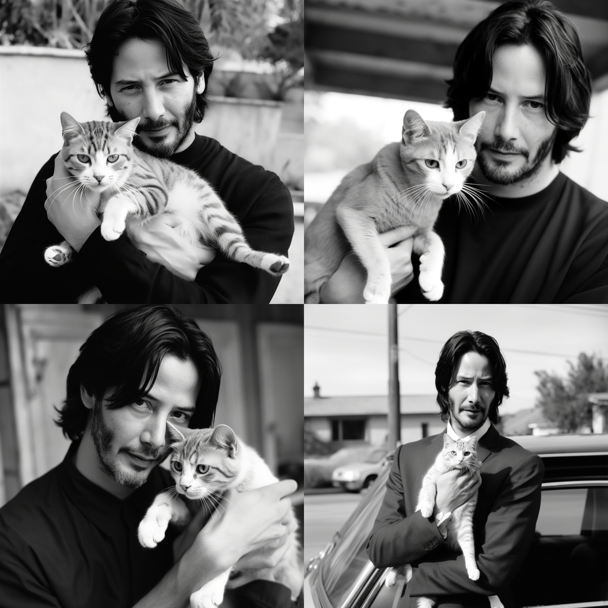
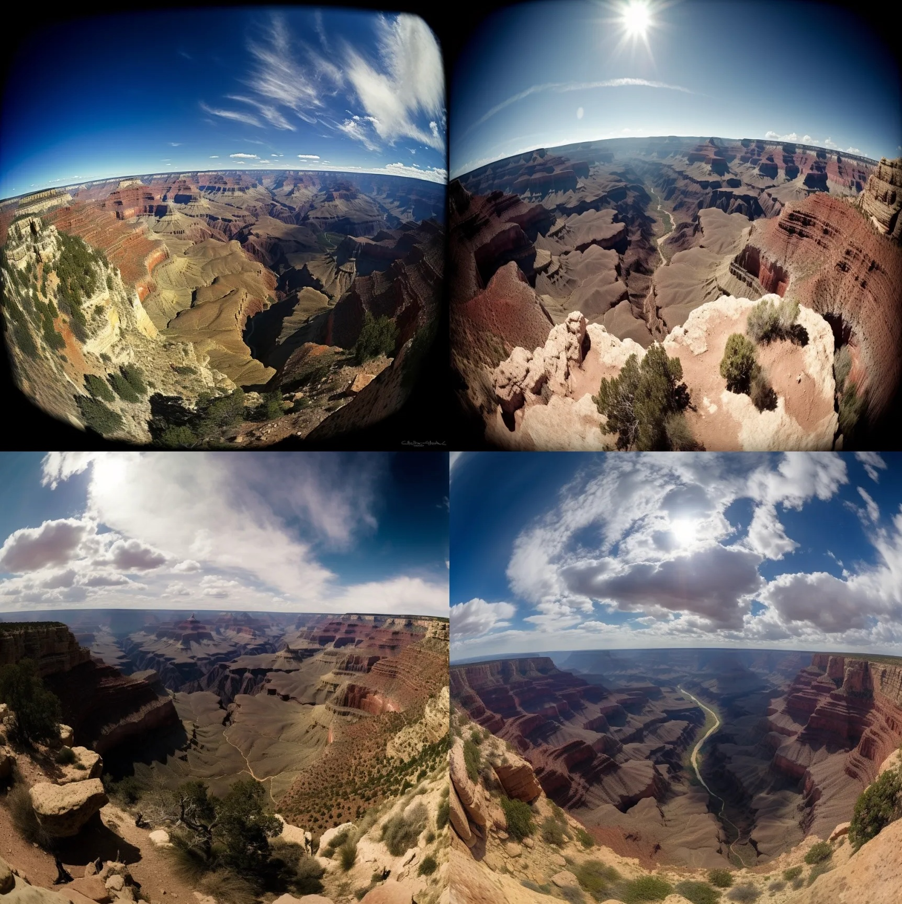
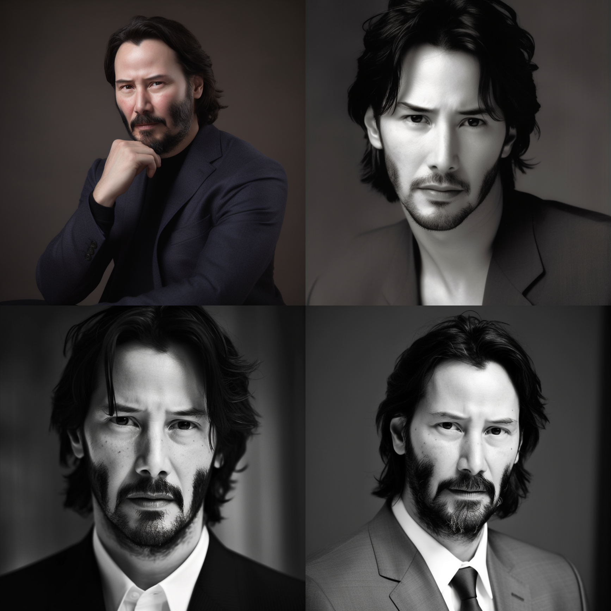
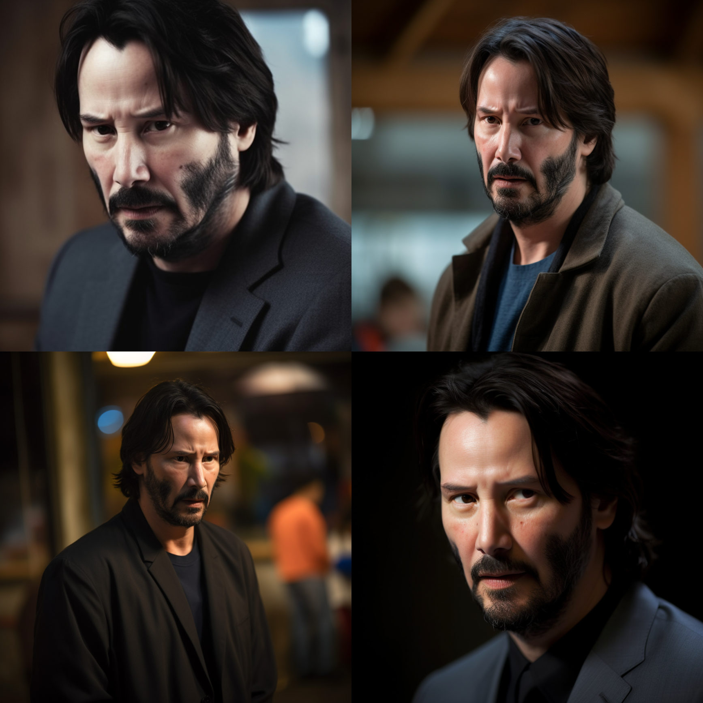

# Scenario 9: Landscapes

With real world objects and people covered, let's look at landscapes. Frankly, I'm not great at photography so may not explain things too professionally here - consider this more an overview of capabilities vs expert advice.

Please excuse any mistakes.

## Miniature Landscapes

You've likely seen epic landscape images across platforms, so won't dive into common methods here. Instead I'll share more novel approaches, starting with:

|                          | **Prompt**        | **Explanation**                                                                                                                                        |
| ------------------------ | ----------------- | ------------------------------------------------------------------------------------------------------------------------------------------------------ |
| What is the type?        | Miniature faking  | Miniature faking, also called tilt-shift, uses camera work and processing to make real life scenes look miniature, like small plastic or metal models. |
| What is the subject?     | Train Lines       | Train lines                                                                                                                                            |
| What is the background?  | null              | Not critical, let AI decide                                                                                                                            |
| What is the composition? | null              | Not critical, let AI decide                                                                                                                            |
| What lens?               | null              | Not critical, let AI decide                                                                                                                            |
| What is the style?       | style of Japanese | I wanted that Japanese train style, so I added this parameter.                                                                                         |

I also made a Mars factory:

|                      | **Prompt**   | **Explanation** |
| -------------------- | ------------ | --------------- |
| What is the subject? | Mars Factory |                 |

I also like using this technique for succulent plants - just use "cute mini Haworthia cymbiformis plant in a pot" or similar:

## Architecture

Strictly speaking not a landscape, but didn't know where else to put this.

Since I'm not in architecture, I'll just share one use case - for man-made structures, you can specify the creator in the subject. For buildings, you don't need to state type:

|                      | **Prompt**                            | **Explanation**                                                                                                             |
| -------------------- | ------------------------------------- | --------------------------------------------------------------------------------------------------------------------------- |
| What is the type?？  | null                                  | Not critical, let AI decide                                                                                                 |
| What is the subject? | Structure by Dame Zaha Mohammad Hadid | Dame Zaha Mohammad Hadid, designer of the School of Design building at my alma mater, The Hong Kong Polytechnic University. |

Right is by Frank Gehry:

Could be interesting to blend architectural styles - may spark intriguing designs!

## Tip 16: Change Camera & Lens

Covered lighting the past few chapters - now let's look at cameras and lenses.

You may have used phone apps that emulate old cameras vs just letting you tweak settings like white balance. Though under the hood they also just modify parameters, the experience can be neat.

You can get similar effects in Midjourney by specifying camera or lens types. From my tests, Midjourney supports:

1. Cameras: GoPro, Polaroid
2. Film: 8mm, 16mm, 35mm
3. Lenses: 15mm lens
4. Camera settings: long exposure, double exposure
5. Depth of field & focus: deep vs shallow focus, vanishing point

I really like the double exposure and long exposure looks:

But choose suitable cameras/lenses for your scene - drone view, for example, won't work well for closeups:

| 
**Photo**
 | **Name**             | **Description**                                                                                                 | **Use Cases**                                                                                                        |
| ---------------------------------------- | -------------------- | --------------------------------------------------------------------------------------------------------------- | -------------------------------------------------------------------------------------------------------------------- |
|                | GoPro                | Action camera perspective                                                                                       | Selfies, action shots                                                                                                |
|               | Drone                | Drone view from above                                                                                           | Aerial, skyline shots                                                                                                |
|                | Polaroid             | Instant camera                                                                                                  |                                                                                                                      |
|                | Black and white film | Monochrome photo                                                                                                |                                                                                                                      |
|                | Kodachrome           | Kodak's vivid, high-contrast, archival color slide film                                                         | Vivid, punchy colors with great longevity                                                                            |
|                | Shot on 8mm          | Portable, easy to use film format with lower resolution                                                         | Everyday life, family, travel                                                                                        |
|                | Shot on 16mm         | 16mm and 35mm mainly used for movies, documentaries, commercials                                                | Movies, documentaries, commercials                                                                                   |
|                | Shot on 35mm         | 16mm and 35mm mainly used for movies, documentaries, commercials                                                | Movies, documentaries, commercials                                                                                   |
|                | Microscopic          | Magnified view                                                                                                  | Enlarging small objects                                                                                              |
|                | Fisheye Lens         | Extreme wide angle 100-180° for distorted, exaggerated perspective                                              | Capturing whole scenes up close                                                                                      |
|                | Wide Angle           | Fit more into frame                                                                                             | Landscapes, fitting more content                                                                                     |
|               | Ultra-Wide Angle     | Even wider field of view than wide angle                                                                        | Landscapes, fitting more content                                                                                     |
|                | Panorama             | Wraparound wide format                                                                                          | Landscapes, fitting more content                                                                                     |
|                | Short Exposure       | Freezing motion of fast moving subjects                                                                         | Sports, vehicles, performances needing frozen motion                                                                 |
|                | Long Exposure        | Light trails for motion, mystical moods                                                                         | Light streaks, night scenes, star trails                                                                             |
|                | Double Exposure      | Overlapping exposures for dense, distorted, hand-drawn effects                                                  | Portraits, landscapes - unique environments and moods                                                                |
|                | f2.8                 | Large apertures let in more light for brighter images. f2.8 has high light transmission suitable for low light. | Can create shallow depth of field to blur background and foreground, ideal for portraits or product shots.           |
|                | Depth of Field       | Range of sharpness - how much is in focus.                                                                      | Used to describe how much of a photo is sharp.                                                                       |
|                | Soft Focus           | Deliberately softening focus for gentle, dreamy aesthetic via specialized lens filters.                         | More about evoking emotion vs deep/shallow focus. Gives a soft, almost blurred complexion to create a romantic look. |
|                | Deep Focus           | Similar to deep depth of field.                                                                                 | Keeping entire scene sharp by using small aperture. Needs small focal lengths or farther shooting distance.          |
|                | Shallow Focus        | Artistically isolates subject, popular for portraits.                                                           | Blurs background by using large aperture to keep only a plane/subject in focus.                                      |
|                | Vanishing Point      | A point infinity used in perspective drawing - parallel lines converge towards it.                              | Helps create realism and depth.                                                                                      |
|                | Vantage Point        | Perspective from a high point looking down diagonally.                                                          | Landscapes, fitting more content                                                                                     |
